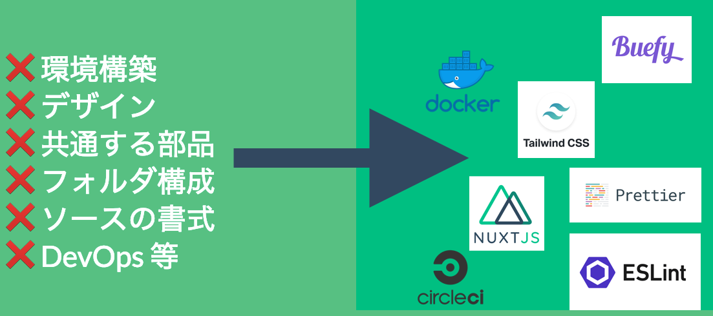
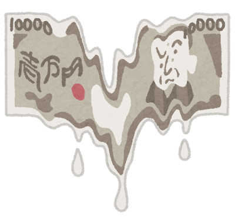

---?color=#00BF81
@title[TOP]
@snap[west span-100 text-white startend]
@size[4rem](みどりいろモザイク番外編)
<br>
@size[4rem](無思考型個人開発のススメ)
@snapend

---?color=#00BF81
@title[自己紹介]
@snap[north-west]
### 自己紹介
@snapend
@snap[west span-60]
名前：坂本さん ( @Skmt3P ) <br>
肩書：個人事業主/エンジニア <br>
拠点：**東京都町田市** <br>
技術：Vue.js, Nuxt.js 他 <br>
活動：4月からやっとVue案件
@snapend
@snap[east span-40]
@img[shadow](assets/img/profile.png)
@snapend

---?color=#00BF81
@title[テーマ選定1]
# 今日のテーマどうしよ？

+++?color=#00BF81
@title[テーマ選定2]
# Nuxt.js?

+++?color=#00BF81
@title[テーマ選定3]
# Firebase?

+++?color=#00BF81
@title[テーマ選定4]
# CircleCI?

+++?color=#00BF81
@title[テーマ選定5]
# 技術書執筆やRe:VIEW?

+++?color=#00BF81
@title[テーマ選定6]
# フリーランスの実態?

+++?color=#00BF81
@title[テーマ選定7]
# それとも...

---?color=#00BF81
@title[テーマ選定8と告知]
@snap[north span-100 headline]
#### それらは技術書典6(こ09)で本出します！
@snapend
@img[shadow](assets/img/qrcode.png)

---?color=#00BF81
@title[テーマ選定9]
# 今日は！

---?color=#00BF81
@title[テーマ決定]
@snap[north span-100 headline]
#### 無思考型個人開発(=造語)の話をしよう！
@snapend


---?color=#00BF81
@title[例]
@snap[north span-100 headline]
#### 個人開発はロジックだけ考えて生きたい
@snapend
@snap[west span-40]
❌ 環境構築 <br>
❌ デザイン <br>
❌ 共通する部品 <br>
❌ フォルダ構成 <br>
❌ ソースの書式 <br>
❌ DevOps 等
@snapend
@snap[east span-60]

@snapend

---?color=#00BF81
@title[主張]
@snap[north span-100 headline]
#### "Done is better than perfect"とはいうけど
@snapend
# Done is MURI !

---?color=#00BF81
@title[だから]
@snap[north span-100 headline]
#### 考えずに生きていける個人開発にしよう
@snapend
@snap[west span-100]

@snapend

---?color=#00BF81
@title[神託]
@snap[north span-100 headline]
#### 神託
@snapend
@snap[west span-100]
### Prettierとlintを疑ってはならない
@snapend


---?color=#00BF81
@title[神の導入]
@snap[north span-100 headline]
#### 神を導入する
@snapend
```
$ yarn add --dev eslint eslint-config-prettier 
  eslint-plugin-prettier prettier prettier-eslint-cli
```

---?color=#00BF81
@title[神を動かす]
@snap[north span-100 headline]
#### 神の社を建立する
@snapend
```
"scripts": {
+ "format": "prettier-eslint --write './app/**/*.{js,vue}' && prettier-eslint --write './functions/*.{js,vue}'",
+ "lint": "eslint --ext .js,.vue --ignore-path .gitignore ."
}
```

---?color=#00BF81
@title[神の御技]
@snap[north span-100 headline]
#### 神の御技を拝観する
@snapend
```
$ yarn format && yarn lint
```

---?color=#00BF81
@title[結果]
@snap[north span-100 headline]
# 😇
@snapend
```
No problems have been detected in the workspace so far.
```

---?color=#00BF81
@title[個人として参加しよう]
@snap[north span-100 headline]
### 個人として参加すると？
@snapend
@snap[west span-45]
- 知見が得られる <br>
- 交流や**営業**できる <br>
- フォロワー増える <br>
- いい経験になる <br>
- **情報交換**できる
@snapend
@snap[east span-55]

@snapend

---?color=#00BF81
@title[企業として参加しよう]
@snap[north span-100 headline]
### 企業として参加すると？
@snapend
@snap[west span-55]
- **ダイマ**できる <br>
- **採用活動**できる <br>
- 社員の教育できる <br>
- フォロワー増える <br>
- **情報交換**できる
@snapend
@snap[east span-45]

@snapend

---?color=#00BF81
@title[参加する方法は]
@snap[north span-100 headline]
#### 個人ならConnpassから参加！企業なら・・・
@snapend
@snap[west span-55]
- 主催 <br>
- 会場提供スポンサー <br>
- 飲食物提供スポンサー <br>
- 金銭提供パートナー <br>
- パトロン
@snapend
@snap[east span-45]

@snapend

---?image=assets/img/majan.png
@title[END]
@snap[west span-100 text-white startend]
@size[4rem](良い勉強会ライフを！)
@snapend
