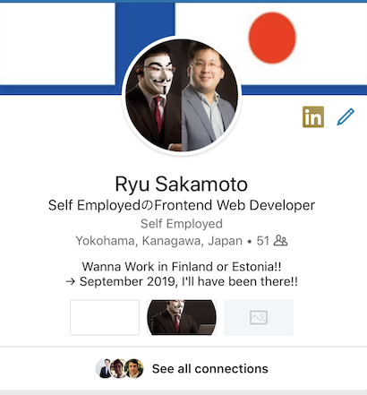
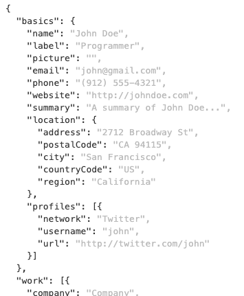
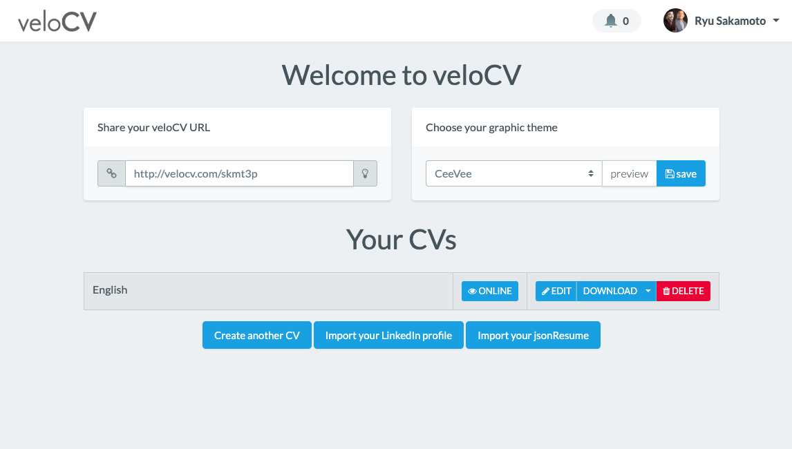
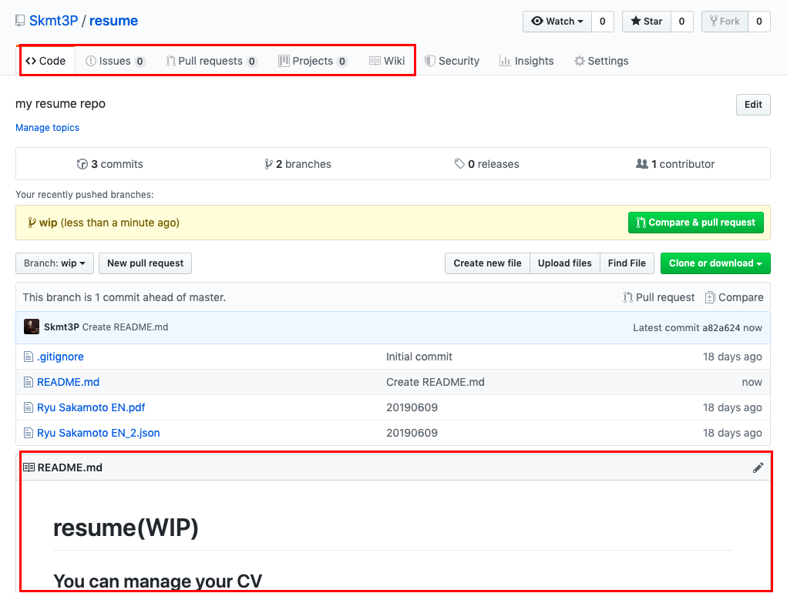

---?color=#00BF81
@title[TOP]
@snap[west span-100 text-white startend]
@size[4rem](Thinking about easy ways to manage your CV)
@snapend

---?image=assets/img/profile_green.png
@title[SelfIntroduction]
@snap[north text-white span-100 headline]
#### Who am I !?
@snapend
@snap[west span-70 text-white]
NAME：Sakamoto-san ( @Skmt3P )  
JOBS：Self-emloyed Engineer  
WHERE：**Machida Tokyo**  
SKILL：Vue, Nuxt  
@snapend
@snap[east span-30]
@img[shadow](assets/img/profile_qr.png)
@snapend

---?color=#00BF81
@title[WannaWorkAt]
@snap[north span-100 headline]
#### I wanna work at Northern Europe.
@snapend
@img[shadow](assets/img/europe-map.png)

+++?color=#00BF81
@title[note]
#### The reason and the current situation are written here.
@snapend
@img[shadow](assets/img/qr_note.jpeg) 
@size[1rem](https://note.mu/skmt3p/n/n7e8af5f07797) 
**And I have to write and manage CV**

---?color=#00BF81
@title[CVis]
## CV ≒ Resume

+++?color=#00BF81
@title[CVis]
## Hassle to write 

+++?color=#00BF81
@title[CVis]
## Hassle to update 

+++?color=#00BF81
@title[CVis]
## Hassle to manage

---?color=#00BF81
@title[CVis]
@snap[north span-100 headline]
#### So I want to manage CV with Git(GitHub).
@snapend

---?color=#00BF81
@title[HowToManage]
@snap[north span-100 headline]
#### How to manage CV with GitHub.
@snapend
1. Write your profile for ***Linkedin***.  
2. Convert ***Linkedin***'s profile to ***JsonResume***.  
3. Import ***JsonResume*** to ***VeloCV***.  
4. Publish the prototype by ***VeloCV***.  
5. WIP: Manage CV with ***GitHub***.

---?color=#00BF81
@title[LinkedIn]
@snap[north span-100 headline]
#### 1. Write your Profile for linkedin.
@snapend
@snap[west span-60]
👍 World wide  
👍 Many Positions  
❌ Not used in Japan  
❌ Hassle to manage  
@snapend
@snap[east span-40]

@snapend

---?color=#00BF81
@title[Convert]
@snap[north span-100 headline]
#### 2. Convert Linkedin's profile to JsonResume.
@snapend
@snap[west span-60]
👍 Very easy  
👍 Able to import to ***VeloCV***   
❌ Some bugs exist...  
❌ Hassle to click once  
@snapend
@snap[east span-40]

@snapend

---?color=#00BF81
@title[Import]
@snap[north span-100 headline]
#### 3. Import JsonResume to VeloCV.
@snapend
@snap[west span-60]
👍 Very easy  
👍 Able to deploy to ***VeloCV***   
❌ Some fixes you need...  
❌ Hassle to fix and click  
@snapend
@snap[east span-40]

@snapend

---?color=#00BF81
@title[Import]
@snap[north span-100 headline]
#### 4. Publish the prototype by VeloCV.
@snapend
@snap[west span-60]
👍 Very easy  
👍 No coding  
❌ Some bugs exist...  
❌ Often go down...  
@snapend
@snap[east span-40]

@snapend

---?color=#00BF81
@title[Import]
@snap[north span-100 headline]
#### 5. WIP: Manage CV with GitHub.
@snapend
@snap[west span-60]
👍 Easy to manage  
👍 Issue, PR, Wiki, README  
❌ Need deliverables  
❌ Decide the rules to manage  
@snapend
@snap[east span-40]

@snapend

---?color=#00BF81
@title[HowToManage2]
@snap[north span-100 headline]
#### How to manage CV with GitHub
@snapend
1. Write your profile for ***Linkedin***  
2. Convert ***Linkedin***'s profile to ***JsonResume***  
3. Import ***JsonResume*** to ***VeloCV***  
4. Publish the prototype by ***VeloCV***  
5. WIP: Manage CV with ***GitHub***

---?color=#00BF81
@title[summary]
@snap[north span-100 headline]
#### Please tell me...
@snapend
1. Better ways to manage CV  
2. The easiest way to become able to use English  
3. The easiest way to work at Northern Europe  

---?color=#00BF81
@title[END]
@snap[west span-100 text-white startend]
@size[3rem](Thanks!!)
@snapend
